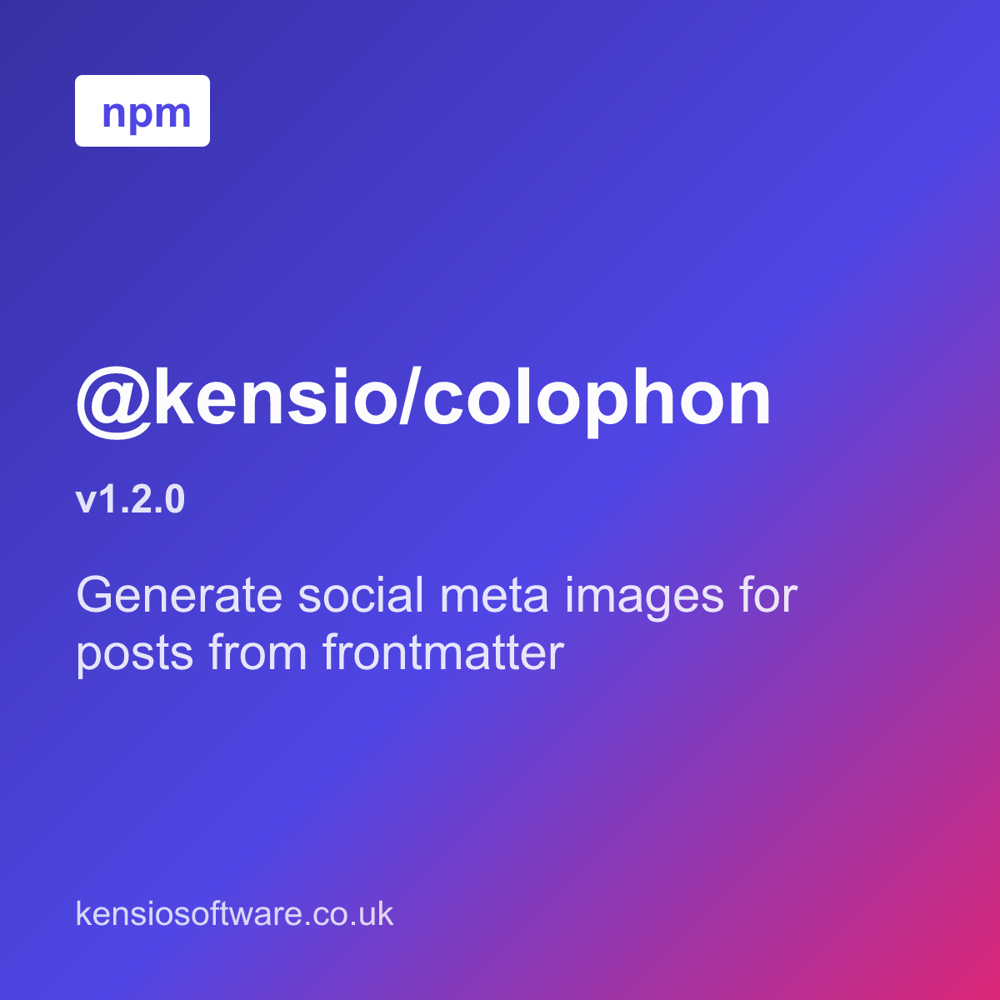
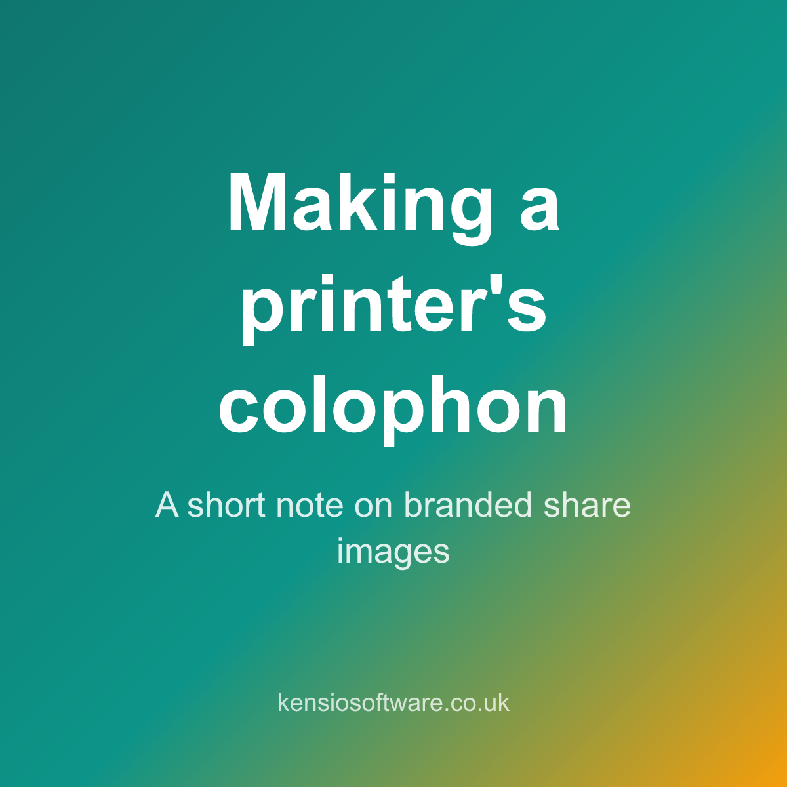
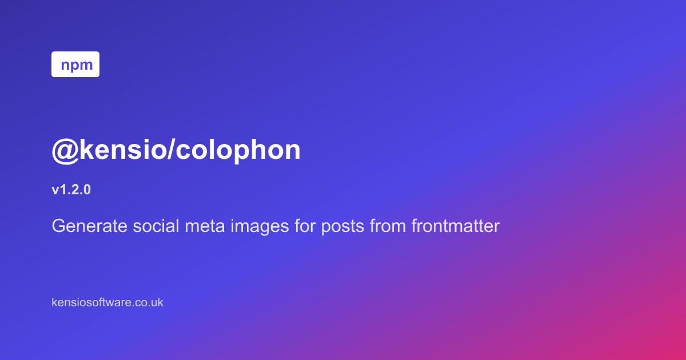
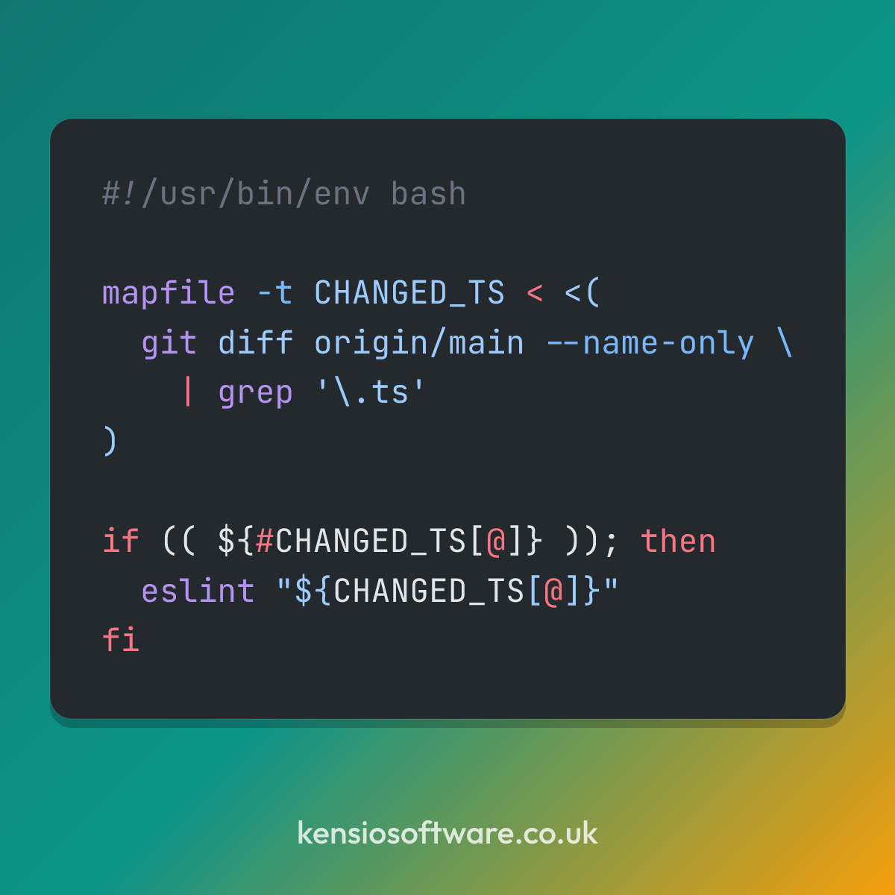
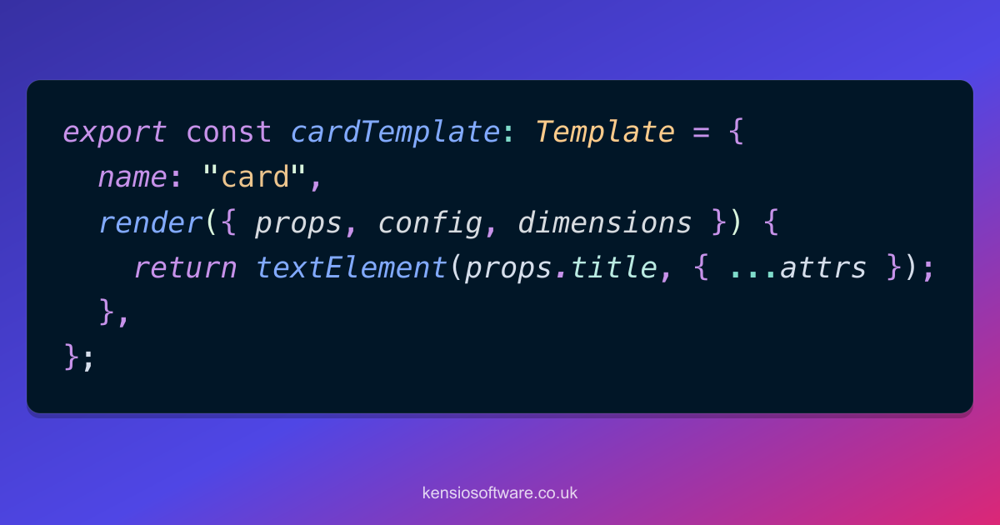

# &nbsp;&nbsp;@kensio/colophon

[](https://www.npmjs.com/package/@kensio/colophon)


Generate social meta images (Open Graph and share-card images) for the posts of
a static website, driven by each post's frontmatter.

[https://colophonjs.dev/](https://colophonjs.dev/ "Colophon documentation website")

You describe an image in frontmatter with a title, a subtitle, a version and a
template name, and Colophon renders branded PNGs at the sizes you need. The name
comes from the printer's _colophon_, the emblem a publisher stamps on a finished
work.

- **Frontmatter-driven.** Props are read from a post rather than fixed by a
  schema.
- **Templates.** A small registry of layouts, picked per post from frontmatter.
- **Syntax-highlighted code images.** The `code` template renders a snippet from
  frontmatter with real VS Code theme colours.
- **Configurable branding.** Colours, gradient, fonts, footer and badge come from
  config, not from any one site's stylesheet.
- **Multiple sizes from one input.** A 1:1 square and a 1.91:1 landscape by
  default, or whatever set you configure.
- **Manifest and meta tags.** A JSON record of what was generated, and the Open
  Graph and Twitter tags that go with it.
- **Small, reusable API.** A render core with no filesystem concerns, plus an
  optional content walker and CLI.

## Install

```bash
pnpm add @kensio/colophon
```

`@resvg/resvg-js` rasterises the SVG to PNG, and `shiki` provides the grammars
and themes for the `code` template. No headless browser is involved. Fonts can
be handed to the renderer as files, so a build renders the same image
everywhere.

## Quick start

Add image props to a post's frontmatter:

```yaml
---
title: My post
meta_img_props:
  template: banner
  title: "@kensio/colophon"
  subtitle: Generate social meta images from frontmatter
  version: 1.2.0
---
```

Create a config module, or omit it to use the neutral defaults:

```ts
// colophon.config.ts
import { defineConfig } from "@kensio/colophon";

export default defineConfig({
  colors: { brand: "#2563eb", brandDark: "#1e3a8a", brandWarm: "#f59e0b" },
  footer: "example.com",
  badge: { text: "npm" },
});
```

Run it over a content tree:

```bash
colophon content --config colophon.config.ts
```

For every file that declares `meta_img_props`, Colophon writes one PNG per
output size next to it, named `<slug>-<size>.png`, so `post/index.md` produces
`post/post-og.png` and `post/post-square.png`.

There is also a programmatic API. `renderMetaImages` takes props and config and
returns rendered bytes, and `generate` ties walking, rendering and writing
together.

## Documentation

Full documentation is in [`docs/`](./docs/).

- [Getting started](./docs/getting-started/ "Install, frontmatter, config and the CLI")
- [Templates](./docs/templates/ "The built-in layouts and how to register your own")
- [The code template](./docs/code-template/ "Syntax-highlighted code images")
- [Configuration](./docs/configuration/ "Every option, and what happens to an unknown one")
- [Rebuilds](./docs/rebuilds/ "How Colophon decides what to render again")
- [Programmatic use](./docs/programmatic-use/ "The API behind the CLI")
- [Upgrading](./docs/upgrading/ "The breaking changes in 2.0 and 3.0")

## Sample output

These are generated by [`scripts/gen-samples.ts`](scripts/gen-samples.ts). Run
`pnpm samples` to regenerate them after changing a template, then commit the
updated PNGs so this gallery stays in sync.

<table>
  <tr>
    <td width="50%">
      <br />
      <sub><code>banner</code> · 1200×1200 · gradient, badge, version, subtitle, footer</sub>
    </td>
    <td width="50%">
      <br />
      <sub><code>card</code> · 1200×1200 · centred title and subtitle</sub>
    </td>
  </tr>
  <tr>
    <td>
      <br />
      <sub><code>banner</code> · 1200×630 · the same input at Open Graph size</sub>
    </td>
    <td>
      <br />
      <sub><code>card</code> · 1200×630 · solid background, title only</sub>
    </td>
  </tr>
  <tr>
    <td>
      <br />
      <sub><code>code</code> · 1200×1200 · bash, <code>github-dark</code></sub>
    </td>
    <td>
      <br />
      <sub><code>code</code> · 1200×630 · TypeScript, <code>night-owl</code></sub>
    </td>
  </tr>
</table>

## Development

| Script                            | What it does                                                               |
| --------------------------------- | -------------------------------------------------------------------------- |
| `pnpm build`                      | Compile to `dist/`.                                                        |
| `pnpm test`, `pnpm test:coverage` | Run Vitest.                                                                |
| `pnpm lint`                       | ESLint and Prettier check.                                                 |
| `pnpm fmt`                        | Auto-fix.                                                                  |
| `pnpm samples`                    | Regenerate the sample images into `docs/samples/`.                         |
| `pnpm fta`                        | [FTA](https://ftaproject.dev) scores, failing on any file 50 or above.     |
| `pnpm check`                      | Format, FTA, typecheck and test with coverage. Run this before committing. |

## License

Apache-2.0
