# &nbsp;&nbsp;@kensio/colophon

[](https://www.npmjs.com/package/@kensio/colophon)


Generate social meta images (Open Graph and share-card images) for the posts of
a static website, driven by each post's frontmatter.

[https://colophonjs.dev/](https://colophonjs.dev/ "Colophon documentation website")

You describe an image in frontmatter with a title, a subtitle, a version and a
template name, and Colophon renders branded PNGs at the sizes you need. The name
comes from the printer's _colophon_, the emblem a publisher stamps on a finished
work.

- **Frontmatter-driven.** Props are read from a post rather than fixed by a
  schema.
- **Templates.** A small registry of layouts, picked per post from frontmatter.
- **Syntax-highlighted code images.** The `code` template renders a snippet from
  frontmatter with real VS Code theme colours.
- **Configurable branding.** Colours, gradient, fonts, footer and badge come from
  config, not from any one site's stylesheet.
- **Themes.** Eight named looks, or your own colours with a mesh, grain, a dot
  grid or ruled lines over them.
- **Multiple sizes from one input.** A 1:1 square and a 1.91:1 landscape by
  default, or whatever set you configure.
- **Manifest and meta tags.** A JSON record of what was generated, and the Open
  Graph and Twitter tags that go with it.
- **Small, reusable API.** A render core with no filesystem concerns, plus an
  optional content walker and CLI.

## Install

```bash
pnpm add @kensio/colophon
```

`@resvg/resvg-js` rasterises the SVG to PNG, and `shiki` provides the grammars
and themes for the `code` template. No headless browser is involved. Fonts can
be handed to the renderer as files, so a build renders the same image
everywhere.

## Quick start

Add image props to a post's frontmatter:

```yaml
---
title: My post
meta_img_props:
  template: banner
  title: "@kensio/colophon"
  subtitle: Generate social meta images from frontmatter
  version: 1.2.0
---
```

Create a config module, or omit it to use the neutral defaults:

```ts
// colophon.config.ts
import { defineConfig } from "@kensio/colophon";

export default defineConfig({
  colors: { brand: "#2563eb", brandDark: "#1e3a8a", brandWarm: "#f59e0b" },
  footer: "example.com",
  badge: { text: "npm" },
});
```

`colophon init` writes that file for you, guessing where your content lives.

Run it over a content tree:

```bash
colophon content --config colophon.config.ts
```

For every file that declares `meta_img_props`, Colophon writes one PNG per
output size next to it, named `<slug>-<size>.png`, so `post/index.md` produces
`post/post-og.png` and `post/post-square.png`. Set `format` to `webp`, `jpeg` or
`avif` for a quarter of the bytes.

While tuning a template, `colophon preview <file>` renders one post and opens
it, `--watch` rebuilds on every change, and `--dry-run` reports what would
change without writing anything.

There is also a programmatic API. `renderMetaImages` takes props and config and
returns rendered bytes, and `generate` ties walking, rendering and writing
together.

## Documentation

Full documentation is in [`docs/`](./docs/).

- [Getting started](./docs/getting-started/ "Install, frontmatter, config and the CLI")
- [The command line](./docs/cli/ "Every command and flag, including init, preview, eject, dry runs and watching")
- [Templates](./docs/templates/ "The built-in layouts and how to register your own")
- [The code template](./docs/code-template/ "Syntax-highlighted code images")
- [Astro](./docs/astro/ "The integration and the meta tags component")
- [The browser-safe core](./docs/core/ "Running the template layer outside Node")
- [The layout toolkit](./docs/layout/ "The primitives templates are built from")
- [Themes and background treatments](./docs/configuration/themes/ "Named looks, meshes, grain, dots and rules")
- [Logos and photographs](./docs/configuration/images/ "Branding an image with a logo, avatar or background photo")
- [Configuration](./docs/configuration/ "Every option, and what happens to an unknown one")
- [Output formats](./docs/configuration/formats/ "WebP, JPEG and AVIF, quality, size caps and the SVG source")
- [File size](./docs/configuration/compression/ "How hard the rendered PNGs are compressed, and what it costs")
- [Rebuilds](./docs/rebuilds/ "How Colophon decides what to render again")
- [Programmatic use](./docs/programmatic-use/ "The API behind the CLI")
- [Upgrading](./docs/upgrading/ "The breaking changes in 2.0 and 3.0")

## Sample output

These are generated by [`scripts/gen-samples.ts`](scripts/gen-samples.ts) from
the sample list in [`test/samples.ts`](test/samples.ts). Run `pnpm samples` to
regenerate them after changing a template, then commit the updated PNGs so this
gallery stays in sync.

<table>
  <tr>
    <td width="50%">
      <br />
      <sub><code>banner</code> · 1200×1200 · gradient, badge, version, subtitle, footer</sub>
    </td>
    <td width="50%">
      <br />
      <sub><code>card</code> · 1200×1200 · centred title and subtitle</sub>
    </td>
  </tr>
  <tr>
    <td>
      <br />
      <sub><code>banner</code> · 1200×630 · the same input at Open Graph size</sub>
    </td>
    <td>
      <br />
      <sub><code>card</code> · 1200×630 · solid background, title only</sub>
    </td>
  </tr>
  <tr>
    <td>
      <br />
      <sub><code>code</code> · 1200×1200 · bash, <code>github-dark</code></sub>
    </td>
    <td>
      <br />
      <sub><code>code</code> · 1200×630 · TypeScript, <code>night-owl</code></sub>
    </td>
  </tr>
  <tr>
    <td>
      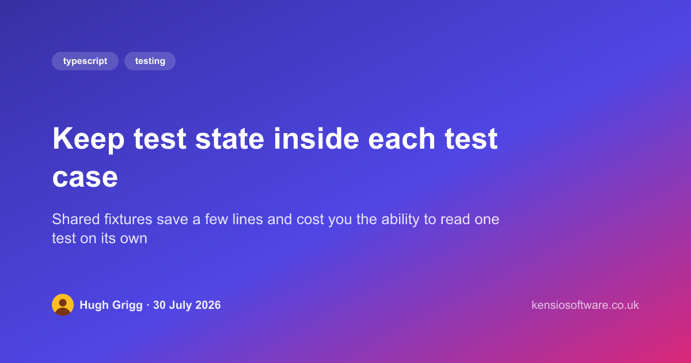<br />
      <sub><code>article</code> · 1200×630 · tags, headline, byline and avatar</sub>
    </td>
    <td>
      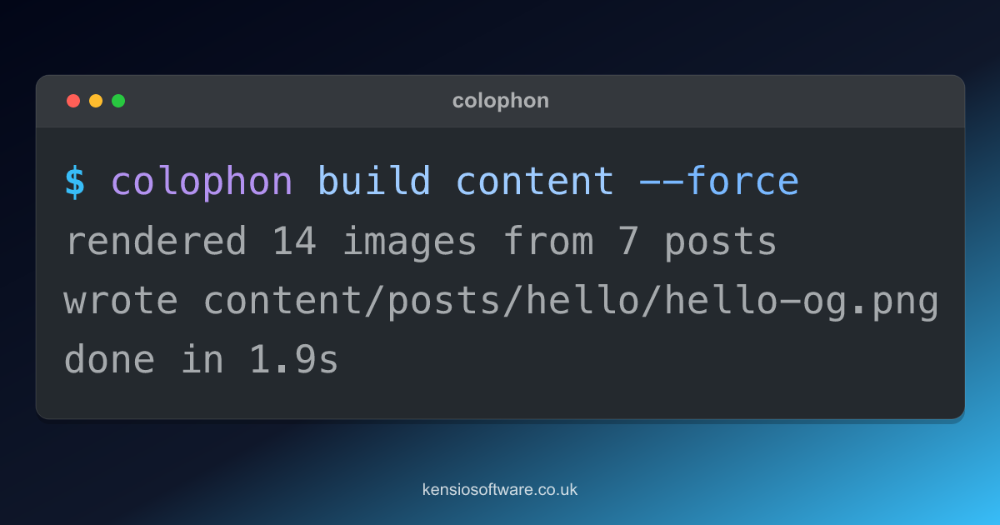<br />
      <sub><code>terminal</code> · 1200×630 · a command and its output</sub>
    </td>
  </tr>
  <tr>
    <td>
      <br />
      <sub><code>quote</code> · 1200×1200 · pull quote with attribution</sub>
    </td>
    <td>
      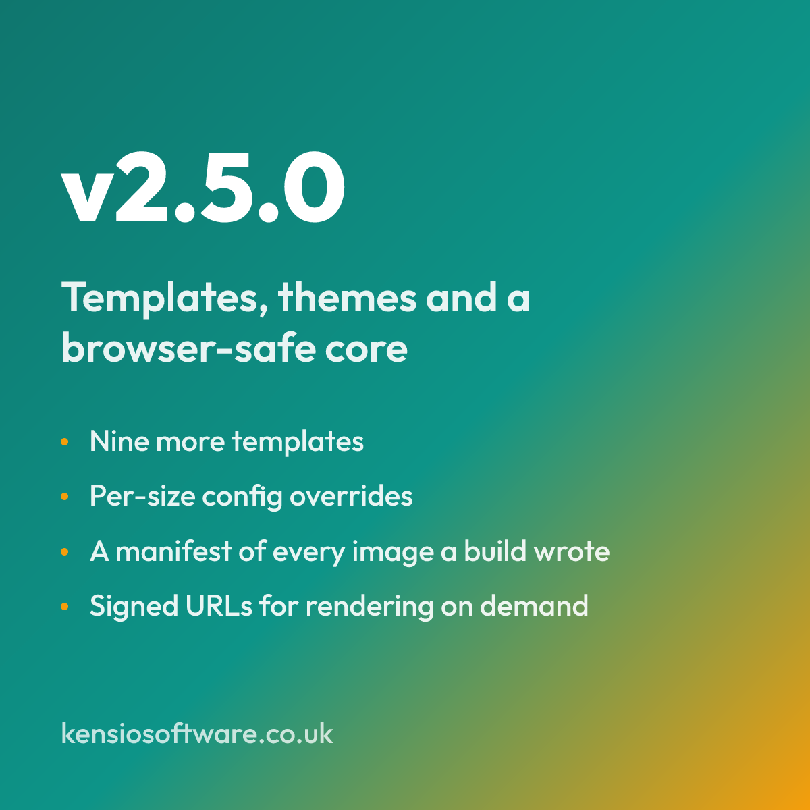<br />
      <sub><code>release</code> · 1200×1200 · version and headline changes</sub>
    </td>
  </tr>
  <tr>
    <td>
      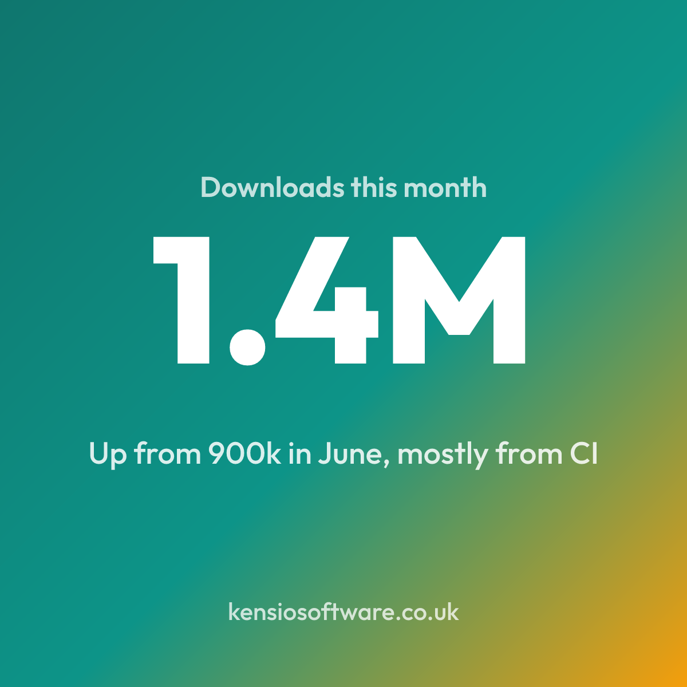<br />
      <sub><code>stat</code> · 1200×1200 · one figure and a caption</sub>
    </td>
    <td>
      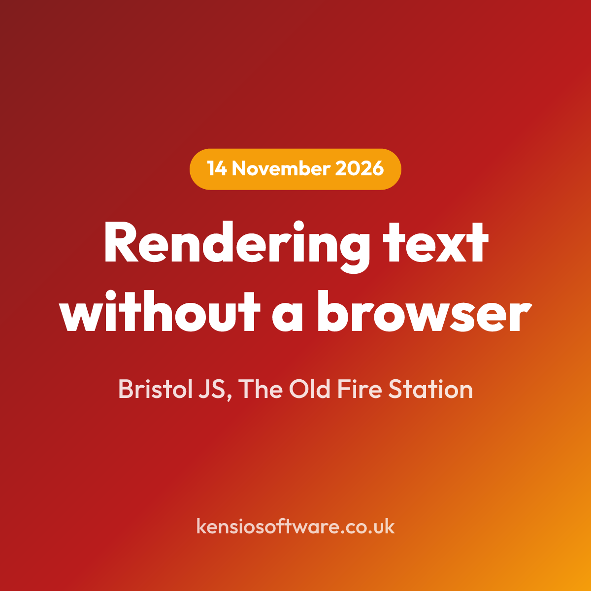<br />
      <sub><code>event</code> · 1200×1200 · date, title and location</sub>
    </td>
  </tr>
  <tr>
    <td>
      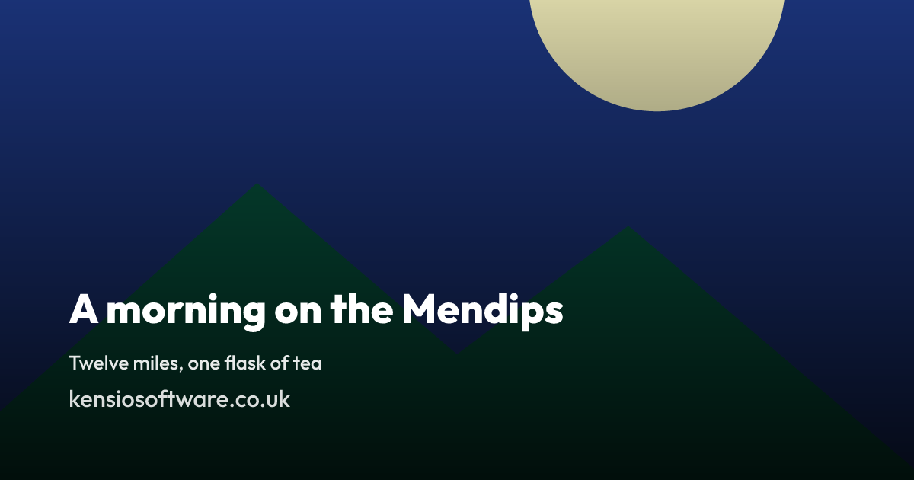<br />
      <sub><code>photo</code> · 1200×630 · the post's own photograph, scrimmed</sub>
    </td>
    <td>
      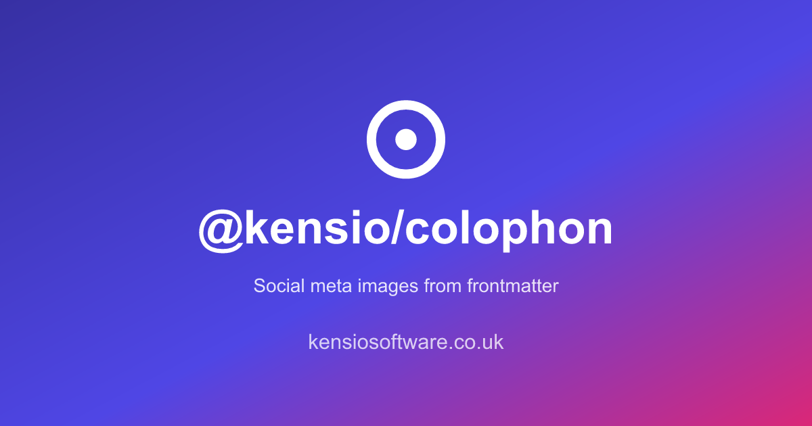<br />
      <sub><code>wordmark</code> · 1200×630 · logo, name and tagline</sub>
    </td>
  </tr>
  <tr>
    <td>
      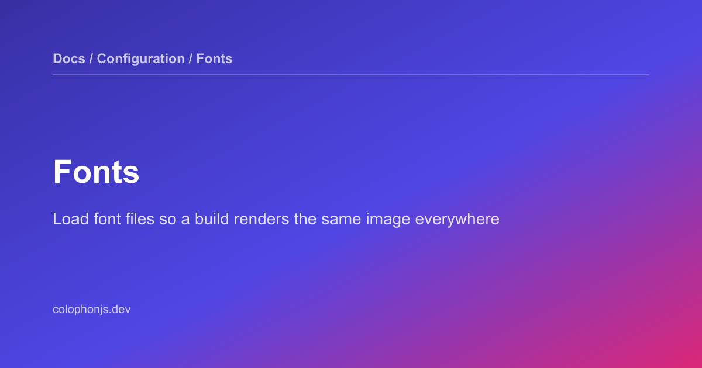<br />
      <sub><code>docs</code> · 1200×630 · breadcrumb, title and summary</sub>
    </td>
    <td></td>
  </tr>
</table>

### Themes

One line of config each: `theme: "midnight"`. See
[Themes and background treatments](./docs/configuration/themes/) for what a
theme sets and how to override part of one.

<table>
  <tr>
    <td width="25%">
      <br />
      <sub><code>midnight</code></sub>
    </td>
    <td width="25%">
      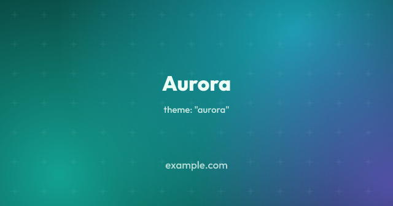<br />
      <sub><code>aurora</code></sub>
    </td>
    <td width="25%">
      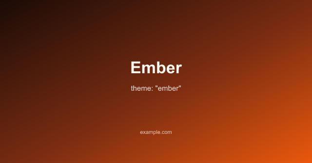<br />
      <sub><code>ember</code></sub>
    </td>
    <td width="25%">
      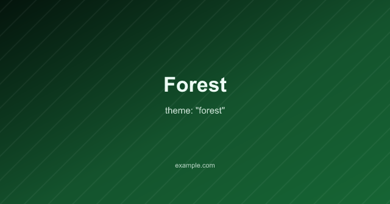<br />
      <sub><code>forest</code></sub>
    </td>
  </tr>
  <tr>
    <td>
      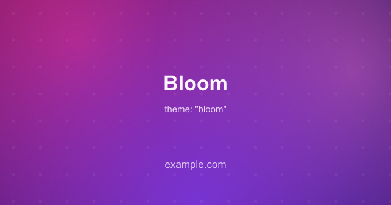<br />
      <sub><code>bloom</code></sub>
    </td>
    <td>
      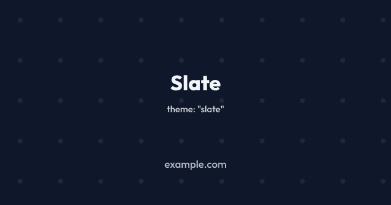<br />
      <sub><code>slate</code></sub>
    </td>
    <td>
      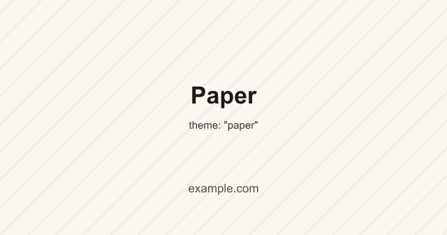<br />
      <sub><code>paper</code></sub>
    </td>
    <td>
      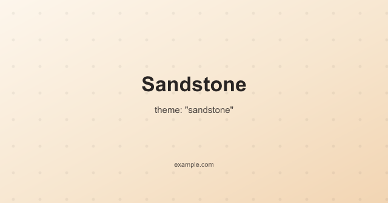<br />
      <sub><code>sandstone</code></sub>
    </td>
  </tr>
</table>

## Development

| Script                            | What it does                                                                 |
| --------------------------------- | ---------------------------------------------------------------------------- |
| `pnpm build`                      | Compile to `dist/`.                                                          |
| `pnpm test`, `pnpm test:coverage` | Run Vitest.                                                                  |
| `pnpm lint`                       | Oxlint, ESLint and oxfmt check, run together.                                |
| `pnpm fmt`                        | Auto-fix.                                                                    |
| `pnpm samples`                    | Regenerate the sample images into `docs/samples/`.                           |
| `pnpm baselines`                  | Re-record the visual regression baselines in `test/baselines/`.              |
| `pnpm fta`                        | [FTA](https://ftaproject.dev) scores, failing on any file 50 or above.       |
| `pnpm check`                      | Format, FTA, typecheck, build and test with coverage. Run before committing. |

### Visual regression

Templates are pictures, so `pnpm test` renders every sample and compares it
against a committed baseline in `test/baselines/`. A change to a template shows
up as a failure naming how far the image moved, and writes what it rendered to
`test/.visual/` so you can open the two side by side. CI uploads the same
images as an artifact when the check fails.

When the change was the point, run `pnpm baselines` and commit the new PNGs with
it. The diff is then the before and after, which is the review the check exists
to make possible.

The baselines are rendered with font files rather than whatever the machine has
installed, and at a fraction of the width they are laid out at, which keeps them
reproducible anywhere and small enough to live in the repository. The gallery
above is rendered separately, as a project would render it.

## License

Apache-2.0
