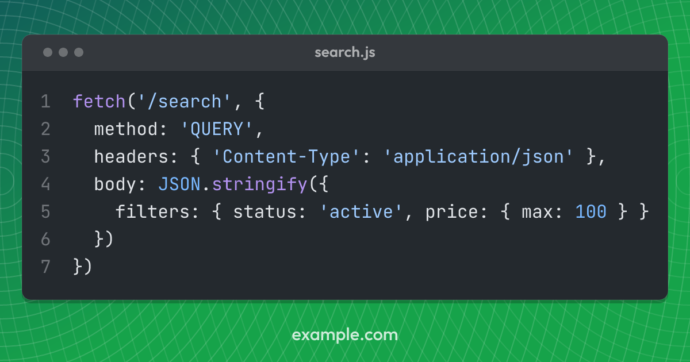
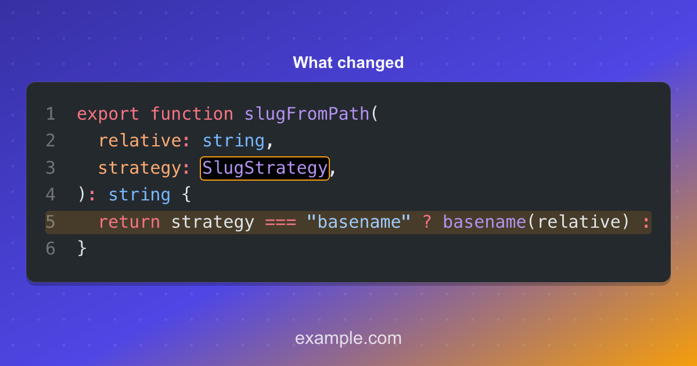

# The code template

The `code` template renders a syntax-highlighted snippet on a rounded panel over
the background. The colours come from a real VS Code theme, by way of
[Shiki](https://shiki.style).

The [`terminal` template](../templates/) is this one with window chrome around
it, so everything on this page applies to it too.

Put the snippet in frontmatter and name its language:

```yaml
---
title: eslint changed TypeScript files only
slug: eslint-changed-ts-files-only
meta_img_props:
  template: code
  language: bash
  code: |
    mapfile -t CHANGED_TS < <(
      git diff origin/main --name-only \
        | grep '\.ts'
    )
---
```

## Props

| Prop       | Notes                                                            |
| ---------- | ---------------------------------------------------------------- |
| `code`     | The snippet. Trimmed, tabs expanded, common indentation removed. |
| `language` | Any [Shiki language]; unknown names fall back to plain text.     |
| `title`    | Optional heading above the panel. Omit for a bare code image.    |
| `filename` | Shown in the window bar, when `code.chrome` draws one.           |
| `mark`     | Text or a line to mark on the snippet. One, or a list.           |
| `theme`    | Optional per-post override of `config.code.theme`.               |

[Shiki language]: https://shiki.style/languages

Pygments-style names carried over from an older pipeline (`text`, `console`,
`html+handlebars` and so on) are mapped onto their Shiki equivalents, so
existing frontmatter usually needs no changes.

A snippet's leading indentation is dropped before anything else happens, so
lifting a sample out of a nested block costs you no width.

The title is drawn above the panel. A title that does not fit on one line wraps
onto a second, and one that does not fit on two is shrunk until it does. The
room it takes comes off the panel below it, so a long title leaves the snippet
less height to be drawn in.

## How the font size is chosen

Colophon measures the widest line and counts the lines, then picks the largest
font size that fits on both axes within `minFontScale` and `maxFontScale`.

Those bounds are fractions of the image _width_, not its height. Width is what a
feed scales a share image to, so it is what legibility tracks. If the bounds
were fractions of the height, a landscape image would render the same snippet at
around half the size of its square counterpart.

Code that will not fit at the floor is truncated with an ellipsis rather than
shrunk to a size nobody can read. The panel then shrinks onto what is left, so
the remaining code is not sitting in a box built for more of it.

That trade matters most on the landscape sizes, which have around half the
vertical room of the square. At the default floor an Open Graph image fits
roughly nine lines of about sixty characters. A snippet written to that budget
renders identically at every size, whereas a longer one keeps its opening lines
and loses the tail. Lower `minFontScale` if you would rather show the whole
snippet small, or set it per size so that only the landscape shrinks; see
[Per-size config](../configuration/per-size-config/).

A finished image gives no sign that the sample continued, so a snippet that had
to lose lines is reported through [`onWarning`](../configuration/warnings/)
instead:

```text
colophon: content/post/index.md: code snippet does not fit the 1200x630 image at
a legible size: 4 of 13 lines dropped. Shorten the sample, or lower
code.minFontScale to fit it in smaller.
```

## Styling

Styling comes from `config.code`:

```ts
export default defineConfig({
  colors: { brand: "#2563eb" },
  footer: "example.com",
  code: {
    theme: "night-owl", // any bundled Shiki theme
    fontFamily: '"JetBrains Mono", monospace',
    lineHeight: 1.55,
    tabSize: 2,
    cornerScale: 0.025,
    maxFontScale: 0.075, // fractions of the image width
    minFontScale: 0.025,
    lineNumbers: false,
    chrome: "none", // or "mono", or "macos"
    panelOpacity: 1,
    borderColor: "#ffffff",
    borderOpacity: 0.12,
  },
});
```

### Line numbers

`lineNumbers` puts a number in front of every line, in the theme's own
foreground at low opacity.

The numbers are drawn on the same lines as the code, which is what keeps them
on its baselines, and the gutter is a count of characters rather than a width,
since a line number really is digits in a monospace face. It takes that width
from the snippet: with numbers on, a long line has that much less room before
it is truncated. The digits reserved are the digits the whole snippet needs, so
the code does not shift left when a line is dropped.

A snippet cut short is numbered as far as it goes. The line that marks the
truncation is not numbered, since it stands for the lines that are not there.

### Window chrome

`chrome` draws a bar across the top of the panel, with the buttons every reader
has seen on a window. `"mono"` draws them in one neutral tone and `"macos"`
draws the traffic lights.



With chrome on, a post's `filename` prop is drawn in the bar:

```yaml
meta_img_props:
  template: code
  language: javascript
  filename: search.js
  code: |
    await fetch("/search", { method: "QUERY" });
```

`title` is unaffected and still sits above the panel. The two say different
things: a title is what the image is about, and a filename is where the code
lives.

The [`terminal` template](../templates/) always draws the bar, with the traffic
lights, since a terminal is a window rather than a decorated panel.

### Marking a token or a line

A post can point at the part of the snippet it is about, with a `mark` prop:

```yaml
meta_img_props:
  template: code
  language: typescript
  mark: SlugStrategy
  code: |
    export function slugFromPath(relative: string, strategy: SlugStrategy) {
```



A string is text to find, and it is boxed where it first appears. Naming the
text rather than the place is what survives the snippet being edited above the
line it is on.

An object names the place instead, for when the same text appears twice or the
thing worth marking is a whole line:

```yaml
mark:
  - text: "'QUERY'"
  - line: 5 # a band across the line
  - { line: 2, column: 11, length: 7 } # the same as the first, by hand
  - { text: JSON, color: "#facc15" }
```

Lines and columns are one-based, as an editor counts them. A mark naming a line
and no column draws a band across it rather than a box around it, which is the
difference between highlighting something and pointing at it.

Marks take `colors.brandWarm` unless one names a `color` of its own, so they
are the one thing on the image that is neither the code theme's colours nor the
site's brand.

A mark is looked for in the snippet **as drawn**, after fitting. Text on a line
that did not fit, or past the width where the line was clipped, is reported
through [`onWarning`](../configuration/warnings/) rather than passed over: an
image cannot show that it is missing a mark, so nothing else would say the post
asked for one.

### The panel itself

`borderColor` and `borderOpacity` are the panel's edge, which is there so that
a dark theme has an edge against a dark background. Set `borderOpacity: 0` for
none.

`panelOpacity` lets the background through the panel, which reads best over a
[texture](../configuration/themes/#textures) worth seeing. Below `1` the
panel's drop shadow is dropped: the shadow is the same rectangle offset a few
pixels, so a translucent surface shows it as a dark wash rather than as depth.

## Supply the monospace face

The template positions every token absolutely at the measured width of the code
before it, so what the face draws decides where each token sits. That width is
measured from the font, which means the face has to be one Colophon loaded:
supply it as a file under [`fonts`](../configuration/fonts/) and name it in
`code.fontFamily`.

Without a file there is nothing to measure, and the layout falls back to
assuming `0.6` of the font size per character. That suits most monospace faces,
including Source Code Pro, Menlo and DejaVu Sans Mono, but Consolas is nearer
`0.55`, and a mismatch shows up as columns drifting across the line.

The default stack ends in the generic `monospace` family, which will resolve to
a face on any machine, but not to the same face on every machine.

This used to be a `code.charWidthRatio` setting. It has gone: see
[Upgrading](../upgrading/).

## Snippets holding CJK

A Chinese, Japanese or Korean character is a full em wide where a Latin one is
a little over half of one, so a line holding them is wider than its character
count suggests. Colophon measures the line rather than counting it, so the
tokens after an ideograph are drawn where the face will put them, and a string
such as `"银行"` no longer has the bracket after it drawn on top of it.

What that does not fix is which face draws them. The default stack names
JetBrains Mono, which has no ideographs, so the rasteriser falls back for the
whole run it cannot draw: a line that is a single token, such as a comment,
comes out entirely in whatever the system offers, which is usually a
proportional sans in the middle of a code panel.

A project with CJK in its snippets wants one face covering both scripts, which
means a CJK monospace such as Sarasa Mono or Noto Sans Mono CJK, supplied as a
file and named on its own:

```js
export default defineConfig({
  fonts: [{ path: "fonts/SarasaMonoSC-Regular.ttf" }],
  code: { fontFamily: "Sarasa Mono SC" },
});
```

These faces set Latin at half an em against a full-em ideograph, which is a
narrower cell than most monospace fonts use. That is measured off the file like
anything else, so nothing has to be told about it.
