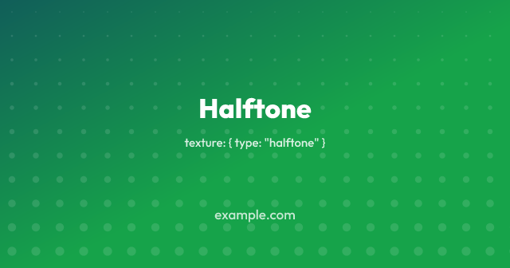
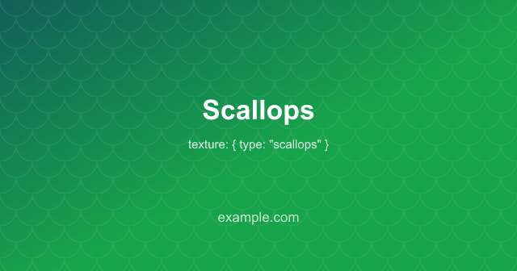
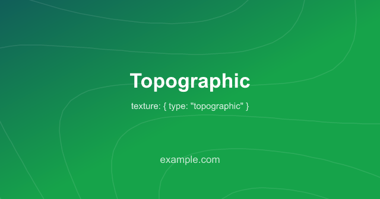

# Themes and background treatments

A theme supplies a colour palette, background and texture. Select one with
the `theme` setting:

```ts
export default defineConfig({
  theme: "midnight",
  footer: "example.com",
});
```

<a id="the-set"></a>

## Available themes

| Theme       | Look                                                 |
| ----------- | ---------------------------------------------------- |
| `midnight`  | Deep navy, indigo and violet mesh, faint dot grid    |
| `aurora`    | Near-black teal under teal and violet, faint crosses |
| `ember`     | Warm dark, brown into orange, rays from below        |
| `forest`    | Deep green, ruled diagonally                         |
| `bloom`     | Violet into pink and magenta, faint dot grid         |
| `slate`     | Flat cool navy with a dot grid                       |
| `paper`     | Warm off-white, ruled, near-black text               |
| `sandstone` | Pale sand gradient with a dot grid, near-black text  |

<table>
  <tr>
    <td width="25%"></td>
    <td width="25%"></td>
    <td width="25%"></td>
    <td width="25%"></td>
  </tr>
  <tr>
    <td></td>
    <td></td>
    <td></td>
    <td></td>
  </tr>
</table>

The set includes six dark themes and two light themes.

## What a theme sets

Themes set `colors`, `background` and `texture`. Explicit config values take
priority over theme defaults:

```ts
export default defineConfig({
  theme: "midnight",
  // Keeps midnight's mesh and dot grid; the badge and text follow this brand.
  colors: { brand: "#0d9488" },
});
```

Changing `colors` overrides text and accent colours but keeps the theme's
background. Set `background` too if you want different background colours.
Without a theme, Colophon derives its default gradient from your brand colours.

An unknown theme name causes a [validation error](../#unknown-options).

## Textures

Use `texture` independently of a theme to draw a pattern over any background:

```ts
export default defineConfig({
  colors: { brand: "#2563eb" },
  texture: { type: "dots" },
});
```

Textures are drawn above the background and below the template content.
Their default opacity is low.

| Texture         | Options                                              |
| --------------- | ---------------------------------------------------- |
| `"dots"`        | `color`, `opacity`, `size`, `gap`                    |
| `"rules"`       | `color`, `opacity`, `width`, `gap`, `angle`, `cross` |
| `"waves"`       | `color`, `opacity`, `width`, `gap`                   |
| `"rays"`        | `color`, `opacity`, `width`, `count`, `x`, `y`       |
| `"moire"`       | `color`, `opacity`, `width`, `gap`, `angle`          |
| `"grid"`        | `color`, `opacity`, `width`, `gap`, `major`          |
| `"crosses"`     | `color`, `opacity`, `size`, `width`, `gap`           |
| `"chevrons"`    | `color`, `opacity`, `width`, `gap`                   |
| `"honeycomb"`   | `color`, `opacity`, `width`, `size`                  |
| `"scallops"`    | `color`, `opacity`, `width`, `size`                  |
| `"halftone"`    | `color`, `opacity`, `size`, `gap`, `angle`, `from`   |
| `"topographic"` | `color`, `opacity`, `width`, `gap`, `relief`, `seed` |

The default texture colour is the foreground colour. Lengths such as `gap`
and `size` are pixels at the output resolution.

Default spacing is designed to remain visible when a share image is reduced
in a feed. Lower `gap` or `size` for a finer pattern.

### Textures at thumbnail size

An image uploaded at 1280px wide may be displayed at a third of that width or
less. Fine textures can become difficult to see at that size.

`textureScale` multiplies every length in the texture:

```ts
export default defineConfig({
  texture: { type: "dots" },
  textureScale: 2,
});
```

Set `textureScale` on a [size](../per-size-config/) when that size will be
displayed smaller. `SIZE_PRESETS.thumbnail` already sets it to `2`.

```ts
sizes: [
  SIZE_PRESETS.og, // drawn at the stated lengths
  SIZE_PRESETS.thumbnail, // twice as coarse
  { ...SIZE_PRESETS.thumbnail, textureScale: 3 }, // or your own figure
],
```

Values below `1` make the texture finer.

### Waves

`waves` draws two sets of concentric rings, centred on the left and right
edges:

```ts
export default defineConfig({
  colors: { brand: "#16a34a" },
  texture: { type: "waves" },
});
```


Overlapping rings create curves across the image. The pattern follows the
image's aspect ratio, with flatter curves on landscape images.

`opacity` controls the left-hand rings. The right-hand rings are fainter.
`gap` sets the distance between rings. Above about `40`, individual circles
become more visible.

<a id="waves-costs-bytes-as-well"></a>

#### Rendering time and file size

Curved, antialiased edges increase PNG file size. This benchmark used one
1200×1200 card over a gradient:

| Texture             | PNG   |
| ------------------- | ----- |
| none                | 36KB  |
| `crosses`           | 42KB  |
| `dots`              | 43KB  |
| `halftone`          | 50KB  |
| `chevrons`          | 57KB  |
| `grid`, `major` `0` | 57KB  |
| `grid`              | 64KB  |
| `rays`              | 78KB  |
| `rules`             | 83KB  |
| `honeycomb`         | 85KB  |
| `scallops`          | 92KB  |
| `topographic`       | 112KB |
| `rules`, `cross`    | 182KB |
| `waves`, `gap` 66   | 228KB |
| `moire`             | 324KB |
| `waves`             | 349KB |

In this benchmark, waves took about 330ms to render, compared with 170ms
without a texture. Try [`format: "webp"`](../formats/) if you need smaller
files.

Increasing spacing reduced the measured waves and moiré PNG sizes from
450KB and 385KB respectively. Dots and grids changed little because the wider
strokes offset the savings from wider spacing.

### Rays

`rays` draws straight lines from an origin just below the image by default:

```ts
export default defineConfig({
  colors: { brand: "#4f46e5" },
  texture: { type: "rays" },
});
```


Set `x` and `y` as fractions of the image dimensions. `{ x: 0, y: 0 }` is the
top-left corner. `count` sets the number of rays around a full circle,
including rays outside the visible image.

In the 1200×1200 benchmark, adding rays increased the PNG from 82KB to 164KB.

### Chevrons and honeycomb

`chevrons` draws rows of V shapes. `honeycomb` draws hexagon outlines:

```ts
export default defineConfig({
  colors: { brand: "#16a34a" },
  texture: { type: "honeycomb" },
});
```

 

For `chevrons`, `gap` controls both the chevron width and row spacing. For
`honeycomb`, `size` is the length of a hexagon side. Its tile is `3 × size`
wide and `size × √3` high.

Both patterns repeat a tile. Their diagonal edges generally produce larger
PNGs than a dot grid.

### Halftone

`halftone` draws a grid of dots that increase in size across the image:

```ts
export default defineConfig({
  colors: { brand: "#16a34a" },
  texture: { type: "halftone" },
});
```



`angle` controls the direction of growth. `0` goes right and the default
`90` goes down. `from` is the smallest dot's size as a fraction of the
largest. Increase it to reduce the difference between small and large dots.

Dot size is determined by position, so the pattern is consistent across
builds.

### Scallops and topographic

`scallops` draws rows of arcs offset by half a scale. `topographic` draws
contour lines over a generated height field.

 

Each topographic line follows a constant height. `relief` controls the
number of contour levels between low and high points. `seed` selects the
height field. The same seed produces the same pattern.

All textures are deterministic. The same inputs produce the same pattern,
which is required for [rebuild stamps](../../rebuilds/) to remain valid.

### Crosshatch

Set `cross: true` on `rules` to add lines at the opposite angle:

```ts
export default defineConfig({
  colors: { brand: "#7c3aed" },
  texture: { type: "rules", cross: true },
});
```


The crossing lines are drawn at lower opacity.

In the 1200×1200 benchmark, one set of rules produced a 94KB PNG and crossed
rules produced 294KB. The extra tones at intersections reduce PNG compression
efficiency.

### Grids and crosses

`grid` draws horizontal and vertical lines, with heavier lines at regular
intervals. `crosses` draws a small cross at each grid point.

```ts
export default defineConfig({
  colors: { brand: "#0369a1" },
  texture: { type: "grid" },
});
```

 

`major` sets the number of squares between heavier grid lines. These lines
use twice the normal width. Set `major: 0` to disable them.

Crosses produce file sizes similar to dots. A grid is somewhat larger
because it contains more line edges.

### Moiré

`moire` overlays two square grids with a small rotation between them:

```ts
export default defineConfig({
  colors: { brand: "#0f766e" },
  texture: { type: "moire" },
});
```


The intersections form broad bands across the image.

`angle` controls the bands. Below about one degree, the bands can be wider
than the image. Above about ten degrees, they form a tighter pattern. `gap`
controls grid spacing.

A 1200×1200 moiré image measured about 320KB as PNG. Increasing `gap` can
reduce file size by reducing the number of line intersections.

## Meshes

A mesh background draws radial colour fades over a flat base:

```ts
export default defineConfig({
  background: {
    type: "mesh",
    color: "#0b1020",
    blobs: [
      { color: "#4338ca", x: 0.12, y: 0.05, radius: 0.55, opacity: 0.85 },
      { color: "#7c3aed", x: 0.9, y: 0.85, radius: 0.5, opacity: 0.7 },
    ],
  },
});
```

Blob positions are fractions of the image dimensions. Radii are fractions
of the longer side. Blobs are drawn in order and fade to transparent at their
radius. A large, fully opaque blob can hide most of the base colour.

## Per size

Set a theme or texture on an [output size](../per-size-config/) to give it
a different appearance:

```ts
sizes: [
  { name: "og", width: 1200, height: 630 },
  { name: "square", width: 1200, height: 1200, theme: "paper" },
],
```

A size's theme supplies defaults. Explicit top-level settings, such as
`texture`, still take priority over those defaults.
