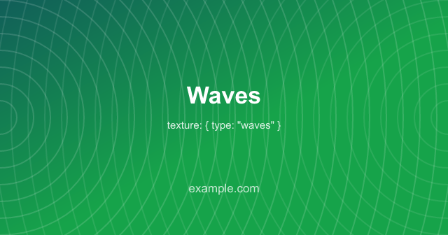
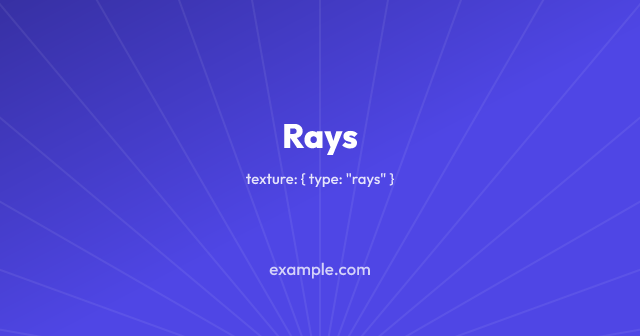
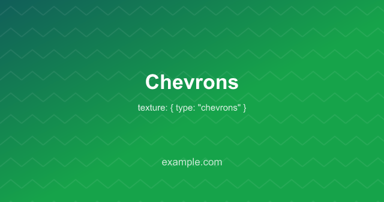
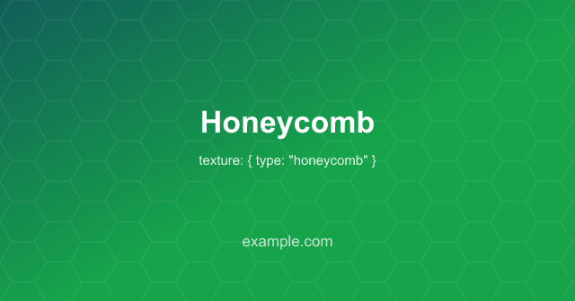
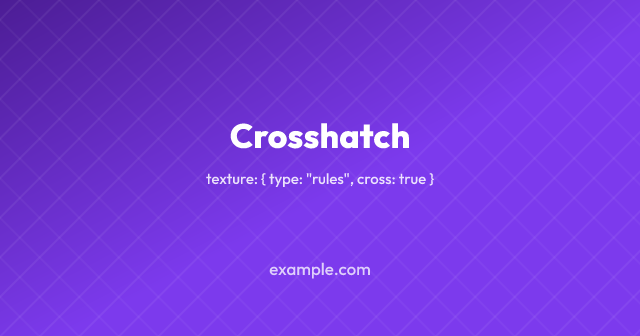
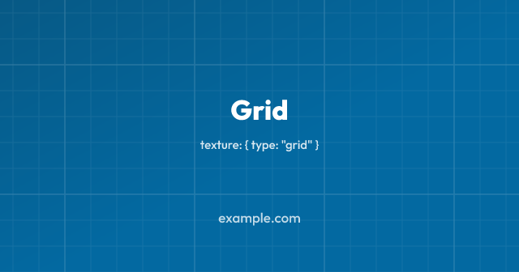
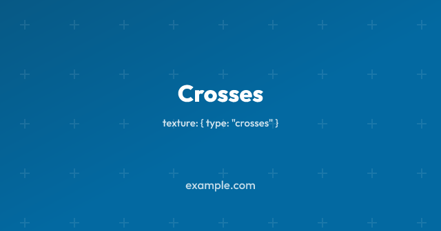
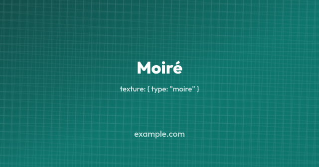

# Themes and background treatments

A theme is a named look, made up of a palette, a background and a texture over
it. Naming one is the shortest config a project can write.

```ts
export default defineConfig({
  theme: "midnight",
  footer: "example.com",
});
```

## The set

| Theme       | Look                                                 |
| ----------- | ---------------------------------------------------- |
| `midnight`  | Deep navy, indigo and violet mesh, faint dot grid    |
| `aurora`    | Near-black teal under teal and violet, faint crosses |
| `ember`     | Warm dark, brown into orange, rays from below        |
| `forest`    | Deep green, ruled diagonally                         |
| `bloom`     | Violet into pink and magenta, faint dot grid         |
| `slate`     | Flat cool navy with a dot grid                       |
| `paper`     | Warm off-white, ruled, near-black text               |
| `sandstone` | Pale sand gradient with a dot grid, near-black text  |

<table>
  <tr>
    <td width="25%"></td>
    <td width="25%"></td>
    <td width="25%"></td>
    <td width="25%"></td>
  </tr>
  <tr>
    <td></td>
    <td></td>
    <td></td>
    <td></td>
  </tr>
</table>

Six are dark, because white text on a deep background is what a share image is
usually asked to be, and two are light for a site whose own pages are.

## What a theme sets

`colors`, `background` and `texture`, and nothing else. Those are
ordinary config options, so a theme is a set of defaults rather than a fixed
look, and any of the three you name yourself is the one that is used.

```ts
export default defineConfig({
  theme: "midnight",
  // Keeps midnight's mesh and dot grid; the badge and text follow this brand.
  colors: { brand: "#0d9488" },
});
```

The consequence worth knowing is the one in that comment. A theme's background
is written out rather than derived from its palette, so changing `colors`
changes the accent and the text and leaves the picture behind them alone. That
is deliberate: `midnight` without its mesh and `slate` without its dot grid are
the same flat navy image, so a theme that was only a palette would have very
little to it. Set `background` as well when you want the whole thing to follow
your own colours, or use `colors` on its own without a theme, which derives the
usual gradient from your brand.

An unknown theme name stops the build rather than being ignored, along with
[every other unrecognised value](../#unknown-options).

## Textures

The treatments can be used on their own, over any background:

```ts
export default defineConfig({
  colors: { brand: "#2563eb" },
  texture: { type: "dots" },
});
```

A texture is drawn over the background and under everything the template draws,
so it never comes between a headline and the reader. All of them are intended
to be noticed only in passing, and the defaults are faint.

| Texture     | Options                                              |
| ----------- | ---------------------------------------------------- |
| `"grain"`   | `opacity`, `scale`                                   |
| `"dots"`    | `color`, `opacity`, `size`, `gap`                    |
| `"rules"`   | `color`, `opacity`, `width`, `gap`, `angle`, `cross` |
| `"waves"`   | `color`, `opacity`, `width`, `gap`                   |
| `"rays"`    | `color`, `opacity`, `width`, `count`, `x`, `y`       |
| `"moire"`   | `color`, `opacity`, `width`, `gap`, `angle`          |
| `"grid"`    | `color`, `opacity`, `width`, `gap`, `major`          |
| `"crosses"` | `color`, `opacity`, `size`, `width`, `gap`           |

Everything but `grain` defaults to the foreground colour, so a texture shows up
on a light theme as readily as on a dark one. Lengths are in pixels at the size
being rendered.

### Waves

`waves` is two sets of concentric rings, one centred on the middle of each side
edge:

```ts
export default defineConfig({
  colors: { brand: "#16a34a" },
  texture: { type: "waves" },
});
```



What you see is not the rings but the interference between the two sets, which
reads as curves flowing across the image. Unlike the dot grid and the ruled
lines it is not a tile, so it does not repeat, and its shape follows the
proportions of the image: a landscape gets flatter curves than a square.

`opacity` is the set drawn from the left, and the set from the right is drawn
fainter than that. `gap` is the distance from one ring to the next, and it is
the setting worth playing with, since it decides how tight the curves are.
Above about 40 the two sets stop blurring into each other and the image reads
as what it is, which is a lot of circles.

#### Waves costs bytes as well

Not as many as grain, and for a different reason. There are only a few dozen
circles to draw, but their antialiased edges put a different set of colours in
every row of the image, which is most of what PNG compresses by. Measured on a
1200×1200 card over a gradient:

| Texture             | PNG   |
| ------------------- | ----- |
| none                | 82KB  |
| `rules`             | 94KB  |
| `dots`              | 101KB |
| `crosses`           | 102KB |
| `grid`, `major` `0` | 150KB |
| `rays`              | 164KB |
| `grid`              | 170KB |
| `chevrons`          | 181KB |
| `honeycomb`         | 246KB |
| `rules`, `cross`    | 294KB |
| `waves`, `gap` 44   | 423KB |
| `moire`             | 589KB |
| `waves`             | 634KB |
| `grain`             | 1.7MB |

Rendering is around 540ms against 210ms with no texture. If the size matters
more than the format does, [`format: "webp"`](../formats/) takes the same
image to 94KB, since a lossy encoding does not care how many colours a row
holds.

### Rays

`rays` is straight lines fanning out from one point, which by default sits just
below the bottom edge of the image:

```ts
export default defineConfig({
  colors: { brand: "#4f46e5" },
  texture: { type: "rays" },
});
```



`x` and `y` move the origin, as fractions of the image, so `{ x: 0, y: 0 }` is
the top-left corner and `{ y: 0.5 }` is a star in the middle rather than a fan
across the picture. `count` is rays around the whole circle, of which only
those pointing into the image are seen, so the spacing stays the same wherever
the origin goes.

Of the treatments that cover the whole image rather than repeating a tile, this
is the cheap one: there are no curves in it and only a few dozen lines, so a
1200×1200 image goes from 82KB to 164KB. That is nearer the dot grid than
`waves`.

### Chevrons and honeycomb

`chevrons` is rows of V shapes, and `honeycomb` is hexagon outlines:

```ts
export default defineConfig({
  colors: { brand: "#16a34a" },
  texture: { type: "honeycomb" },
});
```

 

`chevrons` takes `gap`, which is both how wide one chevron is and how far
apart the rows are. `honeycomb` takes `size`, the length of one side of a
hexagon, and its repeat is the only one here that is not square: a honeycomb
fits in a rectangle three sides across and `size × √3` down.

Both are tiles, and both cost more than the dot grid without being anywhere
near `waves`. What they have that dots and squared paper do not is diagonal
edges, and a diagonal is antialiased differently in every row it passes
through.

### Crosshatch

`rules` takes a `cross` flag, which draws a second set at the opposite angle:

```ts
export default defineConfig({
  colors: { brand: "#7c3aed" },
  texture: { type: "rules", cross: true },
});
```



The crossing set is drawn fainter than the first, which is what makes the two
read as a weave rather than as two sets of lines.

It is not the cheap change it looks like. One set of rules costs 94KB on the
1200×1200 card and two crossing sets cost 294KB, because the crossings put
tones in the image that neither set has on its own, and they land in a
different place in every row. A tile keeps the SVG small; it is the picture
that has to repeat for the file to stay small, and here it does not.

### Grids and crosses

`grid` is squared paper: lines both ways, with a heavier one every so often.
`crosses` is a small cross where each of those lines would meet, which is the
dot grid with a little more to look at.

```ts
export default defineConfig({
  colors: { brand: "#0369a1" },
  texture: { type: "grid" },
});
```

 

`major` is how many squares apart the heavier lines are, drawn at twice the
width. Set `major: 0` for a plain grid with none.

Both are tiles square to the image, so both are among the cheap ones. Crosses
cost about what the dot grid costs. The grid costs a little more, since a row
of the image crosses a great many more lines than it does dots, and the
heavier lines add a second pass over it.

### Moiré

`moire` is two square grids, one turned a few degrees against the other:

```ts
export default defineConfig({
  colors: { brand: "#0f766e" },
  texture: { type: "moire" },
});
```



What is seen is the interference between them rather than either grid: the
lines cross at a different offset in every part of the image, which reads as
broad bands sweeping across it.

`angle` is the whole texture. Below about one degree the bands are wider than
the image, and it looks like one grid slightly out of true; above about ten
they tighten into a weave. `gap` is the second lever, and the one that decides
what the image costs.

It is nearly as expensive as `waves`, at around 590KB for a 1200×1200 image,
which is worth knowing because the reason is not obvious. Being drawn from a
tile makes the SVG small, but the tile is what repeats, not the picture: a
turned grid crosses the lines at a different place in every row, so there is
nothing for the compression to fold up. Raising `gap` is what brings it down.

### Grain costs bytes

`grain` is one turbulence filter, and per-pixel noise is the one thing PNG
cannot compress. It takes a 1200×1200 image from around 600KB to a little over
2MB, and adds roughly 150ms to rendering it.

That is well inside what the social platforms accept, but it is a lot to commit
next to a post, which is why no theme turns grain on by itself. Choose it
deliberately, and look at what lands on disk afterwards.

## Meshes

A mesh is soft blobs of colour over a flat base, which gives colour that moves
in more than one direction, unlike a linear gradient. Each blob is a radial
fade, so it costs no more to render than a gradient does.

```ts
export default defineConfig({
  background: {
    type: "mesh",
    color: "#0b1020",
    blobs: [
      { color: "#4338ca", x: 0.12, y: 0.05, radius: 0.55, opacity: 0.85 },
      { color: "#7c3aed", x: 0.9, y: 0.85, radius: 0.5, opacity: 0.7 },
    ],
  },
});
```

Positions are fractions of the image and radii are fractions of its longer
side, so one mesh describes the same picture at every output size. Blobs are
drawn in order, the later ones over the earlier, and each fades to nothing at
its radius. Keep them off the base colour if you want it to show: a blob at
full opacity with a radius near `1` covers everything.

## Per size

A [size](../per-size-config/) can name its own theme and texture, which is how
a square gets a different treatment from a landscape:

```ts
sizes: [
  { name: "og", width: 1200, height: 630 },
  { name: "square", width: 1200, height: 1200, theme: "paper" },
],
```

A size's theme applies the same way the config's does, as defaults under
anything named outright. So a config with its own `texture` keeps it whatever
theme a size asks for.
