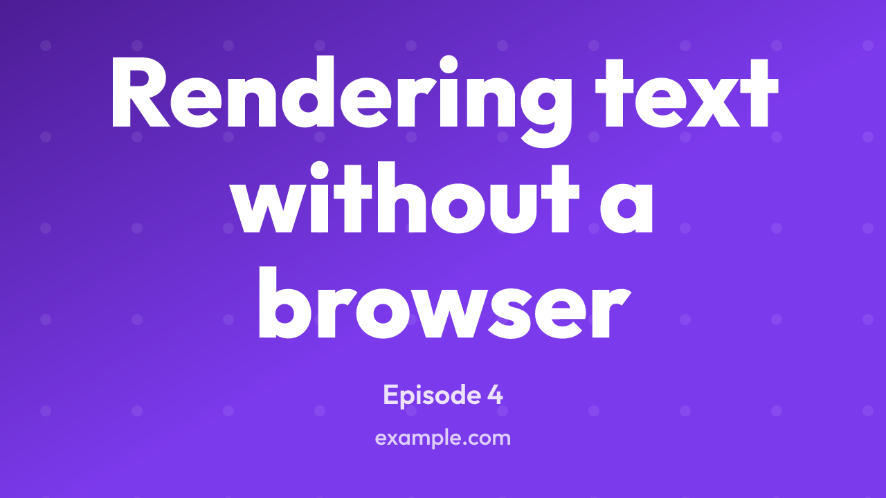

# Templates

A template is a layout. Frontmatter picks one by name, so different posts on the
same site can produce different kinds of image from the same config.

| Name        | Layout                                                                       | Props it reads beyond `title` and `subtitle` |
| ----------- | ---------------------------------------------------------------------------- | -------------------------------------------- |
| `banner`    | Left-aligned title with optional version, subtitle, corner badge and footer. | `version`, `badge`                           |
| `card`      | Minimal centred title with an optional subtitle.                             |                                              |
| `code`      | Syntax-highlighted snippet on a rounded panel over the background.           | `code`, `language`, `theme`                  |
| `article`   | Tags, headline and standfirst, with a byline along the bottom.               | `tags`, `author`, `date`, `avatar`           |
| `quote`     | A pull quote with the speaker under it.                                      | `quote`, `author`, `role`, `avatar`          |
| `terminal`  | A command and its output, in window chrome.                                  | `command`, `output`, `prompt`, `title`       |
| `release`   | A version, what it is, and the headline changes as a list.                   | `version`, `changes`                         |
| `stat`      | One big figure with a label above and a caption below.                       | `stat`                                       |
| `photo`     | The post's photograph, scrimmed, with the title over the bottom of it.       | `image`                                      |
| `wordmark`  | The configured logo above a name and tagline.                                |                                              |
| `docs`      | A breadcrumb trail, a rule, then the page's title.                           | `breadcrumb`                                 |
| `event`     | A date on a plate, then what the event is and where.                         | `date`, `location`                           |
| `thumbnail` | One title grown to fill the frame, for a video thumbnail.                    |                                              |
| `cover`     | A mark beside a name and tagline, for a profile header.                      |                                              |

The `code` template has enough of its own behaviour to need
[a page of its own](../code-template/). Every one of the others is described
under [The templates one by one](#the-templates-one-by-one) below.

All of them draw the configured [footer](../configuration/). Most draw the
configured logo too, in the corner the layout leaves free, except that
`wordmark` puts it in the middle as the subject of the image and `code`,
`terminal` and `quote` draw no logo at all: the first two have a panel where it
would go, and the third is a quotation with nothing else on the image. See
[Logos, avatars and photographs](../configuration/images/) for where each one
puts them.

Anything a template reads and the post does not carry is left out, and the rest
of the layout takes the room back.

## Choosing a template

The `template` field inside the props block names it:

```yaml
---
meta_img_props:
  template: card
  title: About
---
```

A post that names no template gets `content.defaultTemplate`, which is unset by
default. Both the field name and the default are configurable under `content`;
see [Frontmatter](../configuration/frontmatter/).

Naming a template that is not registered fails the build and lists the ones that
are, because a name typed into frontmatter is easy to get wrong:

```text
Unknown template "bannner". Available templates: article, banner, card,
code, cover, docs, event, photo, quote, release, stat, terminal, thumbnail,
wordmark.
```

## The badge on a banner

A `badge` in config is the same corner badge on every `banner` image a site
renders, which suits a site whose posts are all of a kind. A post can say
otherwise:

```yaml
---
meta_img_props:
  template: banner
  title: Keep test state inside each test case
  badge: false
---
```

`false` draws no badge on that image, and the title takes back the room that was
being reserved above it. An object replaces the configured badge instead, so a
post can carry one the config knows nothing about:

```yaml
---
meta_img_props:
  template: banner
  title: Simulating S3 in a test suite
  badge:
    text: video
    background: "#111827"
    color: "#f9fafb"
---
```

Only `text` is required, and the colours default to white on the brand colour as
they do in config. A post's badge wins over a
[per-size](../configuration/per-size-config/) one as well, since it describes
the post rather than the shape of the image.

A `badge` that is neither an object with text nor `false` is
[reported](../configuration/warnings/) and the configured badge is drawn, which
leaves the post with the image it would have had if it had said nothing.

## The templates one by one

### `article`

The usual blog card, with tags along the top, the headline and its standfirst
in the middle, and the author and date along the bottom.

```yaml
---
meta_img_props:
  template: article
  title: Keep test state inside each test case
  subtitle: Shared fixtures save a few lines and cost you the ability to read one test on its own
  tags: [typescript, testing]
  author: Hugh Grigg
  date: 30 July 2026
  avatar: ./authors/hugh.png
---
```

`tags` may be a list or a single value, and tags that do not fit are dropped
rather than wrapped: the row is a hint at the subject, not the post's whole tag
list. The `avatar` is drawn beside the byline rather than beside the footer, so
the two ends of the bottom line say different things: who wrote this post at
the left, whose site it is at the right. Where there is not room for both, the
date goes first and the author's name is cut only if it has to be.

Nothing here parses the date. Whatever the post wrote is what is drawn, since a
build cannot know which locale the site is in or how much precision the post
wanted.

### `quote`

A pull quote, with an oversized quotation mark in the accent colour above the
words and the speaker below them.

```yaml
---
meta_img_props:
  template: quote
  quote: A template is a layout, and a layout is arithmetic you can look at.
  author: Hugh Grigg
  role: Kensio Software
---
```

`title` is read where there is no `quote`, since a post about one sentence
usually has that sentence in its title already. There is no logo on this one:
the quotation is the whole image.

### `terminal`

A command and what it printed, drawn in a terminal window. The same text on a
plain panel reads as a snippet, whereas in a window it reads as something
somebody ran.

```yaml
---
meta_img_props:
  template: terminal
  title: colophon
  command: colophon build content --force
  output: |
    rendered 14 images from 7 posts
    done in 1.9s
---
```

`prompt` defaults to `$`, and `title` goes in the window's bar rather than
above it. The command is highlighted as shell; the output is not, since a shell
grammar run over arbitrary output colours words for reasons the reader cannot
see.

A `command` of several lines is several commands, so each one gets its own
prompt, which is what a terminal shows for a run of them. A blank line between
two does not, since a prompt with nothing after it reads as a command that was
never typed.

Underneath it is the `code` template, so everything under
[`code`](../code-template/) applies here too: the monospace family, the line
height, the font-size bounds, and the syntax theme the window takes its
background and foreground from. A session too long to fit is truncated with an
ellipsis and [reported](../configuration/warnings/), exactly as a snippet is.

### `release`

A changelog post, with the version as the headline, what the release is below
it, and then the headline changes.

```yaml
---
meta_img_props:
  template: release
  version: 2.5.0
  title: Templates, themes and a browser-safe core
  changes:
    - Nine more templates
    - A manifest of every image a build wrote
---
```

A `v` goes in front of the version unless it already has one, so `2.5.0` and
`v2.5.0` both draw `v2.5.0`. Four changes are drawn and the rest are left to
the post; each is one line, cut with an ellipsis where it is too long.

### `stat`

One figure with a label above and a caption below.

```yaml
---
meta_img_props:
  template: stat
  title: Downloads this month
  stat: 1.4M
  subtitle: Up from 900k in June
---
```

The figure shrinks a long way rather than wrapping, since `42` and
`1.4 million downloads` are both things people write in that field.

### `photo`

The post's own photograph, with the title set over the bottom of it.

```yaml
---
meta_img_props:
  template: photo
  title: A morning on the Mendips
  subtitle: Twelve miles, one flask of tea
  image: ./posts/mendips/hero.jpg
---
```

`image` is a path or a `data:` URI, loaded the way
[`avatar`](../configuration/images/) is. It comes from the post rather than
from config because config is the same for every post, whereas this template
exists to put a different photograph on each one. A post with no `image` still
renders, over whatever background is configured.

The wash over the picture is not optional and is heavier than the one a
[configured background image](../configuration/images/) gets, because here the
words sit right on top of it. Text over an unshaded photograph is legible or
not depending on what the photograph happens to hold, and a build cannot look
at it.

### `wordmark`

The logo above a name and a tagline, for a homepage or a repository preview,
where the thing being shared is the project rather than a post.

```yaml
---
meta_img_props:
  template: wordmark
  title: "@kensio/colophon"
  subtitle: Social meta images from frontmatter
---
```

The mark is part of the centred group rather than pinned to a corner, since
here it is the subject. The name is always one line, shrunk as far as it takes
and then cut, because a scoped package name is one long word and wrapping it
breaks it mid-word.

### `docs`

A reference page, with the trail that leads to it above a rule and its title
below.

```yaml
---
meta_img_props:
  template: docs
  breadcrumb: [Docs, Configuration, Fonts]
  title: Fonts
  subtitle: Load font files so a build renders the same image everywhere
---
```

Docs pages share badly on their own: "Fonts" says nothing about which project's.
`breadcrumb` may be a list or a single string, and a trail too wide for the
image loses its leading segments to an ellipsis rather than its last ones,
which are the ones that say where the page sits.

### `event`

An image for a talk, a meetup or a workshop.

```yaml
---
meta_img_props:
  template: event
  date: 14 November 2026
  title: Rendering text without a browser
  location: Bristol JS, The Old Fire Station
---
```

The date is set on a plate in the accent colour rather than as another line of
text, because it is the one thing a reader is scanning for. As with `article`,
the date is drawn as written.

### `thumbnail`

A video thumbnail: one title, set as large as it will go.

```yaml
---
meta_img_props:
  template: thumbnail
  title: Rendering text without a browser
  subtitle: Episode 4
---
```



Render it at `SIZE_PRESETS.thumbnail`, which is the 1280x720 YouTube asks for:

```ts
import { defineConfig, SIZE_PRESETS } from "@kensio/colophon";

export default defineConfig({
  sizes: [SIZE_PRESETS.og, SIZE_PRESETS.thumbnail],
});
```

What makes this a template rather than a `card` at other proportions is where
the image is looked at. A share card is seen more or less at the size it was
rendered; a thumbnail is seen in a list, a sidebar or a phone, at something
between a third and a sixth of it. Three things follow from that.

The title is grown to fill the frame rather than set at a fraction of the
height, so a three-word title is drawn much larger than a twelve-word one. Every
other template does the opposite, and is right to: a heading that swelled to fill
its space would stop looking like a heading. Here the words are the picture.

There is one text field. `subtitle` is available for a series name or an episode
number and is drawn small under the title, taking its room from the title's, but
the format rewards leaving it out.

The margins are tighter than elsewhere, since the room they give back is the
point. The configured logo and footer are still drawn, and a size can drop the
footer with `footer: ""` where the title should have the whole frame.

One thing worth knowing about the text: it grows until it hits either the width
or the height, and more lines set larger beats one line set small. A long title
therefore wraps onto four or five lines rather than shrinking, which is what
reads at thumbnail size. A title too long to fit even at the floor, around a
tenth of the image height, is cut to the lines there is room for.

Textures want to be coarser here too, for the same reason the text does. See
[`textureScale`](../configuration/themes/#textures-at-thumbnail-size).

### `cover`

A profile cover: the configured logo beside a name, with a tagline under it.

```yaml
---
meta_img_props:
  template: cover
  title: Kensio Software
  subtitle: Tools for people who publish on the web
---
```


This is the header image at the top of a profile rather than a card attached to
a post, so it is made once for a site and usually declared in
[`extra`](../configuration/extra-images/) rather than driven by frontmatter:

```ts
import { defineConfig, SIZE_PRESETS } from "@kensio/colophon";

export default defineConfig({
  extra: [
    {
      props: {
        template: "cover",
        title: "Kensio Software",
        subtitle: "Tools for people who publish on the web",
      },
      output: "public/covers/x.png",
      size: SIZE_PRESETS.xCover,
    },
  ],
});
```

There is a preset per platform, each carrying the safe area that platform's crop
and avatar leave behind. [Cover images](../configuration/cover-images/) has the
sizes, the safe areas and where the numbers came from.

What makes this a template rather than the `wordmark` at other proportions is
the shape of the space. A cover is a strip somewhere between 2.6:1 and 6:1, and
a layout that stacks a mark above a name has nothing left to set the name in. So
the mark goes beside the words, and the pair is centred as one lockup. A site
with no logo configured gets the words alone, centred the same way.

The name is one line, shrunk to fit and cut with an ellipsis if it still will
not, for the reason the `wordmark`'s is: a name broken across two lines stops
reading as a name, and on a strip there is no second line to break onto anyway.
The tagline may wrap to two.

#### Tracking the tagline to the name

`tracking: fill` spaces the tagline's characters out until it is exactly as wide
as the name above it, so the pair share both edges and read as one block:

```yaml
---
meta_img_props:
  template: cover
  title: Kensio Software
  subtitle: kensiosoftware.co.uk
  tracking: fill
---
```

This is the adjustment somebody makes by hand in a drawing program and then has
to make again every time the words change. A site URL under a product name is
what it is for.

It is opt-in, and it declines rather than doing something silly in three cases.
A tagline already as wide as the name is left alone, because the only way to
close the gap would be to pull the letters together, and letters pushed apart
read as a decision where letters pulled together read as a mistake. A tagline
that wrapped to two lines is left alone, since justifying every line to the same
width goes wrong on the short last one the way justified text always does. And a
tagline needing more than half an em between its characters is left alone, which
is the point past which a two-word strapline under a long name stops looking
considered.

`trackingFor` and `trackedWidth` are exported from
[`@kensio/colophon/layout`](../layout/), so a template of your own can do the
same thing. `TextLine` carries the result as `letterSpacing`.

The other thing it does differently is size its text from the room it has rather
than from the image. Everywhere else those are nearly the same number; on a
YouTube banner they are 423 and 1440, so a title set at a tenth of the image
would be a third of the height of the part anyone sees.

## Writing your own

Pass `templates` in config. The keys are the names frontmatter uses, and what
you supply is merged over the built-ins, so a key of `banner` replaces the
built-in `banner`.

A template's `render` receives the props, the resolved config, the pixel
dimensions of the image being drawn, a `measure` for its text, and the `logo`
and `avatar` for the image, already loaded. It returns
the SVG _foreground_ content. The background and the enclosing `<svg>` root are
added by the renderer, so a template does not draw them.

```ts
import { defineConfig, type Template } from "@kensio/colophon";
import { box, drawLines, blockLines, inset } from "@kensio/colophon/layout";

const stripe: Template = {
  name: "stripe",
  render({ props, config, dimensions, measure }) {
    const full = { x: 0, y: 0, ...dimensions };
    const content = inset(full, Math.round(dimensions.width * 0.07));

    const lines = blockLines(props.title, measure, config.fontFamily, {
      maxWidth: content.width,
      maxLines: 2,
      fontSize: Math.round(dimensions.height * 0.1),
      floor: 0.65,
      fontWeight: 700,
      opacity: 1,
    });

    return (
      box(
        {
          x: 0,
          y: dimensions.height - 32,
          width: dimensions.width,
          height: 32,
        },
        { fill: config.colors.brandWarm },
      ) +
      drawLines(lines, content, {
        fontFamily: config.fontFamily,
        fill: config.colors.foreground,
      })
    );
  },
};

export default defineConfig({
  colors: { brand: "#2563eb" },
  templates: { stripe },
});
```

Those primitives are [the layout toolkit](../layout/), which is what the
built-in templates are written on. Returning a string you built yourself works
just as well, and `escapeXml` is exported for when you do.

Some notes on writing one:

- **Size everything from `dimensions`.** The same template is asked to draw a
  1200x1200 square and a 1200x630 landscape. Fractions of the width travel
  better than fixed pixel values, since that is what a feed scales the image to.
- **Escape anything that came from frontmatter.** The toolkit does it for you;
  `escapeXml` is exported for the SVG you write by hand. A title containing `&`
  produces an invalid document otherwise.
- **`props` is open.** Colophon does not check what a template reads, so you can
  put whatever fields your layout needs into the props block.
- **Images arrive loaded.** `logo` and `avatar` are `undefined` or an asset with
  a `href` to hand to `image` and the `aspect` to size it by. Reading files is
  the renderer's job, which is what keeps `render` a function over values. See
  [Logos and photographs](../configuration/images/).
- **`render` may return a promise** if it has to load something. Keep it
  synchronous when it does not need to. The built-in `code` template is async
  because it loads syntax grammars on demand.
- **Measure text rather than guessing at it.** `measure(text, style)` gives the
  width in pixels that a run of text will occupy, read from the font the build
  is rendering with. Widths are exact where the family resolves to a font
  supplied under [`fonts`](../configuration/fonts/) and estimated otherwise, so
  a template never has to handle the two cases itself. `blockLines` and
  `fitText` do the usual jobs of breaking a title across lines and shrinking one
  that does not fit; see [the layout toolkit](../layout/).

`config` here is the resolved config, with defaults applied and per-size
overrides folded in, so `config.colors.brandWarm` is always a colour and
`config.footer` is either a string or `undefined`.
